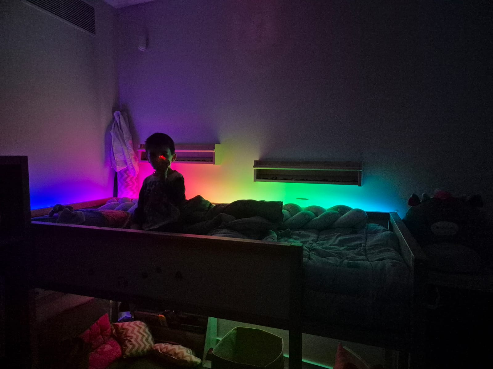
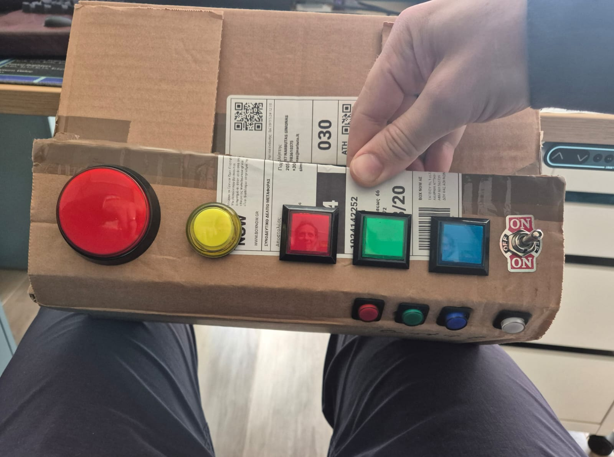
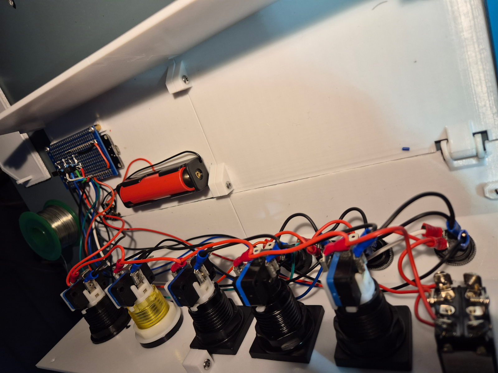
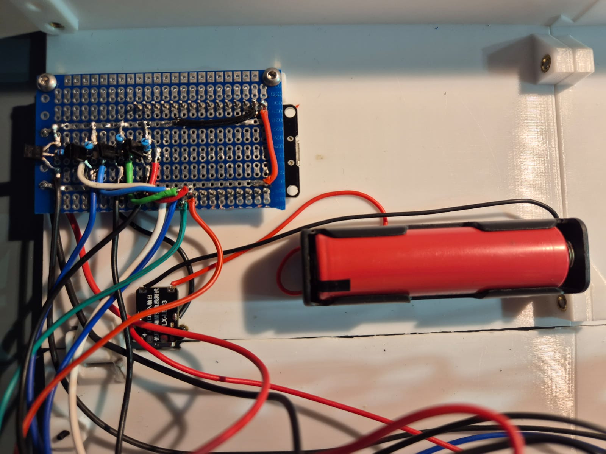
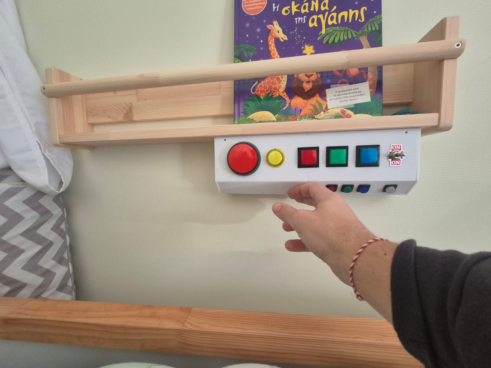
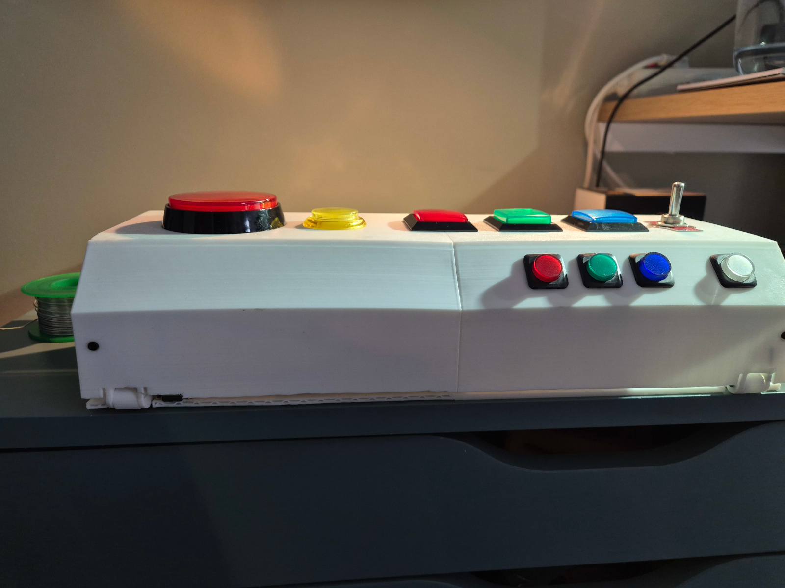
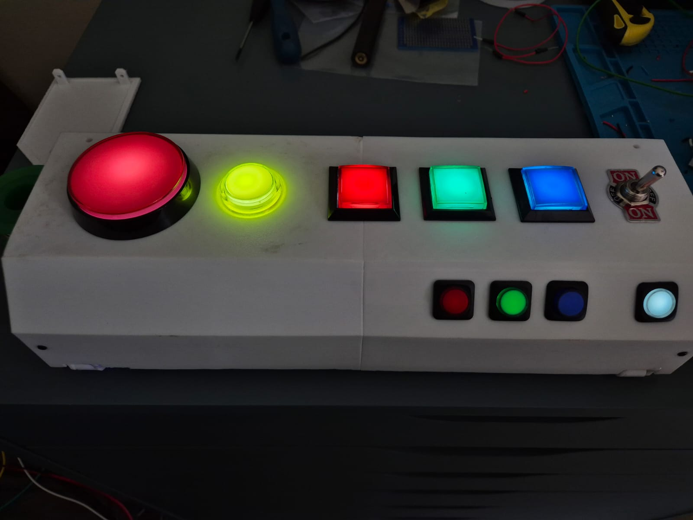

# Project Gallery

A visual walkthrough of the RGB LED bed controller project.

---

### 🌈 Bed LEDs In Action

The SK6812 RGBW LED strip installed around the bed frame.

---

### 🧪 Early Prototype

Laying out arcade buttons on a cardboard box to validate the design and spot early issues before CAD modeling.

---

### 🧠 Internals

Shows the USB-C charging module, 18650 battery, PCB prototyping board, detachable wires. You can see how the case is pulled together.

Early shot of the MCU and transistor and charging module wiring. Hard to make out details from the picture but it gives general idea.

---

### 📦 Mounted Control Box

The final control box mounted next to the bunk bed. Hinges are at the bottom back, so whe lid will be hanging when pulled down by gravity when opened.

---

### ✅ Finished Control Box

Side view of the case. USB-C charging port. Hinge design flaws. Wall had to be shaved to allow hinges to open. Front needed supports in the middle when printing as the walls slightly arched in the middle.

The completed box—ready for some serious 4yo abuse.
